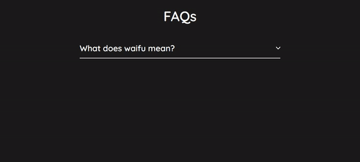

# Responsive-FAQ
A very easy FAO template for you're website.

- Preview:



- Add more section:
copy this and paste it in the last div
```

            <div class="faq">
                <div class="question">
                    <h3>What does waifu mean?</h3>
                    <svg width="15" height="10" viewBox="0 0 42 25">
                        <path d="M3 3L21 21L39 3" stroke="white" stroke-width="7" stroke-linecap="round"/>
                    </svg>
                </div>
                <div class="answer">
                    <p>
                        Waifu is a term for a fictional character, usually in anime or related media, that someone has great, and sometimes romantic, affection for
                    </p>
                </div>
            </div>
```            
